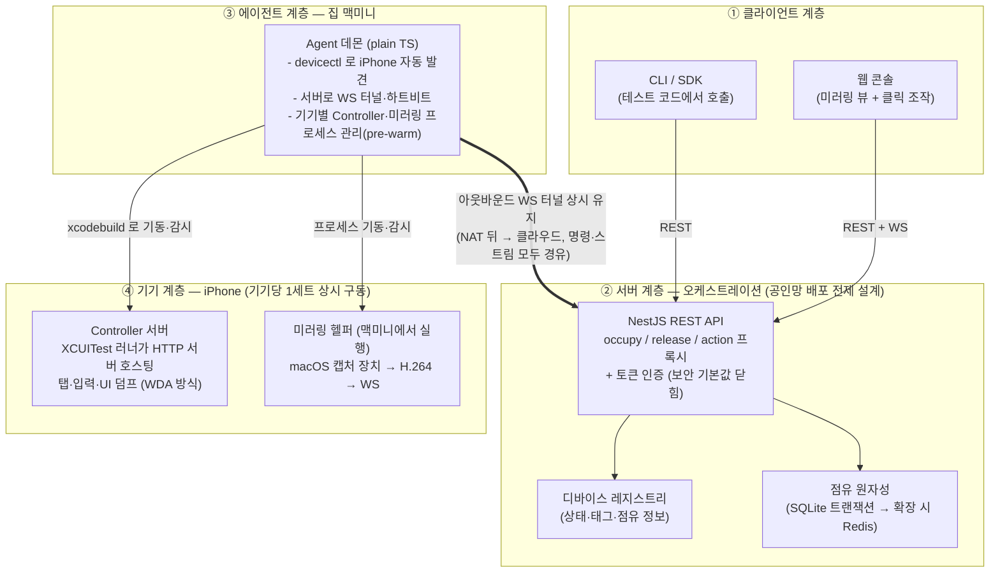
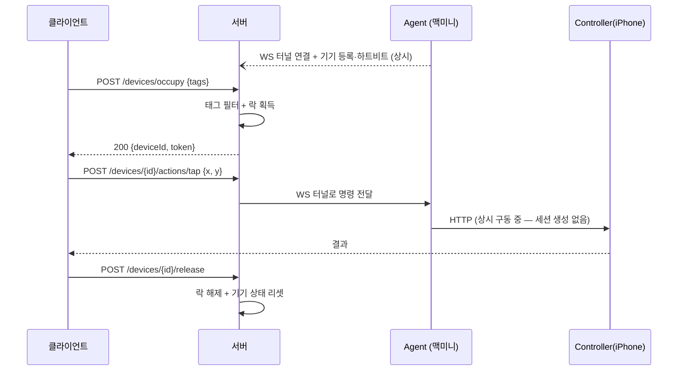

# nebula-clone

토스 디바이스 팜 **Nebula** 따라해보기 — **iOS 단독 버전**
(원문: [토스는 어떻게 수백 대의 기기를 하나의 테스트 인프라로 만들었을까](https://toss.tech/article/device-farm-nebula))

## 원문 요약 — Nebula가 푸는 문제

- 팀마다 Appium 세팅 + 기기 5~10대를 각자 운영 → 중복 작업, 자원 분산, 보안 관리 부담
- 이를 **전사 공용 디바이스 팜**으로 중앙화: 웹 콘솔 / SDK / CLI 로 누구나 실기기 점유·조작
- Appium을 버리고 **자체 드라이버** 개발: 세션리스(stateless HTTP) + 상시 pre-warm 컨트롤러로
  클릭 52ms(Appium 702ms), 세션 시작 15~40초 오버헤드 제거
- iOS 미러링이 최대 난제: USB 직결 캡처는 조작 세션과 충돌, Appium MJPEG는 10~15fps 슬라이드쇼.
  macOS 내장 캡처 장치를 활용해 "보면서 동시에 조작" + 60~120fps 달성

## 이 클론의 범위

- **iOS만 구현** — Android는 범위 외 (원문과 달리 기기가 iPhone 공기계 1대)
- **실제 구동이 목표** — 실기기에서 점유 → 조작 → 미러링까지 돌아가는 상태까지 간다
  (달성 — 전 구간 실기기 검증 완료, 로드맵 참고)
- **로컬 실행 전용** — 클라우드 배포는 범위에서 제외. 단 설계는 "서버가 공인망, Agent가 NAT 뒤"
  토폴로지를 전제해 아웃바운드 터널 구조를 유지한다

## 목표 아키텍처

원문과 동일한 4계층 구조. 설계 토폴로지는 "오케스트레이션 = 클라우드(공인 IP), 호스트 = 집 맥미니"를
전제해 명령 방향을 뒤집는다 — NAT 뒤의 Agent가 서버로 **아웃바운드 WS 터널**을 상시 유지하고,
명령·미러링 스트림 모두 이 터널을 경유한다. (실행은 로컬 — 서버·Agent·웹을 같은 맥에서 구동)



### 핵심 설계 결정

| 항목 | 원문 (Nebula) | 이 클론 | 이유 |
|---|---|---|---|
| 플랫폼 | Android + iOS | **iOS만** | 보유 기기가 iPhone 공기계 1대 |
| 드라이버 | Appium 대체 자체 개발 (Swift + XCTest) | 동일 — 자체 XCUITest 러너 (WDA 구조 참고) | 이 프로젝트의 학습 핵심 |
| 세션 모델 | 세션리스, 컨트롤러 상시 구동 | 동일 — XCUITest 러너 상시 구동 + stateless HTTP | 세션 오버헤드 제거 구조 체험 |
| 테스트 큐 | Kafka + Runner 병렬 소비 | 생략 → 동기 REST만 | 규모상 불필요 (YAGNI) |
| 점유 락 | 분산 락 | SQLite 트랜잭션 원자 점유 (`DevicesRepository` 인터페이스로 저장소 분리) | 서버 1대면 충분 |
| 명령 방향 | 서버 → Agent (사내망) | Agent → 서버 아웃바운드 WS 터널 | 맥미니가 NAT 뒤라는 전제 유지 |
| iOS 미러링 | macOS 내장 캡처 장치, 60~120fps | 동일 — CoreMediaIO 캡처 → VideoToolbox **H.264 단독** (실측 40~60fps) | 초기 JPEG 스크린샷 폴백(3.5fps)은 느려서 폐기 |
| API 스펙 | OpenAPI → 코드 생성 (계약 우선) | 코드 우선 생성 → 클라이언트 자동 생성 | Nest 생태계(`@nestjs/swagger`)에 자연스러운 방향 |

### 점유 → 조작 → 해제 흐름



## 기술 스택 (확정)

- **서버**: **NestJS** — 레지스트리/점유/명령 프록시/미러링 릴레이를 모듈 경계로 대응.
  점유 원자성은 SQLite 트랜잭션(better-sqlite3), 저장소 교체는 `DevicesRepository` 인터페이스,
  하트비트 만료는 `@nestjs/schedule`(Cron), 터널·릴레이는 `@nestjs/websockets` 게이트웨이,
  경계 검증은 class-validator. 공인망 노출 전제라 토큰 인증 필수(보안 기본값 닫힘)
- **Agent**: 프레임워크 없는 **plain TypeScript 데몬** (맥미니) — `xcrun devicectl`로 기기 발견,
  서버로 WS 터널 유지, `xcodebuild test-without-building`으로 Controller 기동·감시,
  mirror-helper 프로세스 상시 구동(pre-warm)
- **iOS Controller**: **Swift + XCUITest** — XCTest 러너 안에서 HTTP 서버를 호스팅하고
  `XCUICoordinate.tap()` / `typeText()` / accessibility 스냅샷(UI 덤프)을 노출 (WebDriverAgent 구조 참고,
  기능은 최소로 자체 구현)
- **미러링 (H.264 단독)**: Swift 헬퍼(`mirror-helper`) — macOS가 USB 연결된 iPhone을 캡처 장치로
  인식(CoreMediaIO — QuickTime 녹화와 같은 메커니즘) → AVFoundation 캡처 → VideoToolbox H.264 →
  Agent가 터널로 바이너리 푸시 (실기기 검증 완료. 초기의 XCUITest 스크린샷 폴링 폴백은 폐기)
- **웹 콘솔**: React + TypeScript + Vite, WebCodecs `VideoDecoder`로 H.264 디코딩 (실기기 검증 완료)
- **저장소**: SQLite (레지스트리 + 점유 상태)
- **레포 구조**: pnpm workspace + Nx 모노레포 (`server` / `agent` / `shared` / `web`) +
  `controller-ios` (Swift, XcodeGen — workspace 밖)

## 실행 환경 요구사항

- **맥 1대** — 서버·Agent·웹 콘솔·미러링 헬퍼 실행, Xcode 설치 (XCUITest 러너 빌드·기동에 필수)
- **iPhone 공기계 1대** — 설정에서 **Developer Mode 활성화** (iOS 16+).
  발견·조작은 Wi-Fi로도 동작하지만 **미러링 캡처 장치는 USB 연결 필수** (실측)
- **코드 서명** — XCUITest 러너를 기기에 설치하려면 서명 필요.
  무료 Apple ID는 7일마다 재서명, 유료 개발자 계정($99/년)은 1년 유효
- Node.js 24+, pnpm

## 실행 방법

```bash
pnpm install

# 1) 서버
cd packages/server
cp .env.example .env   # 토큰 교체 필수 — openssl rand -hex 32 (24자 미만·플레이스홀더면 기동 실패)
pnpm build && pnpm start        # 개발 모드: pnpm start:dev

# 2) 미러링 헬퍼 (선택 — 미설정 시 미러링만 비활성, 조작은 동작)
cd mirror-helper && swift build

# 3) Agent
cd packages/agent
cp .env.example .env   # 서버 주소·토큰 + NEBULA_XCODEBUILD_ENABLED + NEBULA_MIRROR_HELPER
pnpm build && pnpm start

# 4) 웹 콘솔
cd packages/web && pnpm start:dev   # 설정 패널에 서버 주소·클라이언트 토큰 입력

# 테스트: 루트에서 pnpm test (Nx 캐시 적용)
```

- REST 문서: `http://localhost:3000/docs` (Swagger) — 무인증 노출이라 `ENABLE_DOCS=true`일 때만 활성 (기본 꺼짐)
- 클라이언트 인증: `Authorization: Bearer $NEBULA_CLIENT_TOKEN`
- Agent WS 터널: `ws://host:3000/agent?agentId=<id>&token=$NEBULA_AGENT_TOKEN`

## 로드맵

- [x] **Phase 1 — 뼈대**: NestJS 서버(occupy/release/레지스트리/토큰 인증) + Agent(devicectl 기기 발견,
      WS 터널, 하트비트) — 로컬 e2e 구동 확인 (실기기 발견은 Phase 2에서 검증 완료,
      클라우드 배포는 로컬 전용으로 확정하며 범위 제외)
- [x] **Phase 2 — 제어**: 명령 파이프라인 전 구간 **실기기 검증 완료** (2026-09-07, iPhone/iOS 26.6.1) —
      devicectl 자동 발견 → 점유 → 서버 API 탭·스와이프·UI 덤프가 USB(iproxy) 경유로 실제 동작.
      XCUITest 러너의 main.sync 런루프 전제, hardwareProperties.platform 필드 파싱도 실측 확정
- [x] **Phase 2.5 — 운영 자동화**: Controller 수퍼바이저 실기기 검증 완료 (2026-09-07) —
      `NEBULA_XCODEBUILD_ENABLED=true`면 Agent가 기기별 러너·iproxy를 자동 기동, 10초 헬스 폴링,
      죽으면 백오프 재기동(강제 kill → 2초 후 복구 실측). 준비된 기기는 `controller-ready` 태그로
      점유 필터 가능. 남은 것: 7일 재서명 자동화 검증(시간 경과 필요)
- [x] **Phase 3 — 미러링 (H.264, 원문 방식)**: 실기기 검증 완료 (2026-09-07) — **40fps, 8KB/frame,
      1290×2796**. macOS 캡처 장치(CoreMediaIO) → VideoToolbox H.264(`mirror-helper`) → Agent가
      터널로 바이너리 푸시 → 서버 릴레이(`/stream` WS) → 브라우저 WebCodecs 디코딩.
      H.264 단독 상시 구동(pre-warm) — 초기의 JPEG 스크린샷 폴백(3.5fps)은 느려서 제거.
      macOS 26 함정 2개(DiscoverySession 미노출 → CMIO UID 직접 열기, 최초 발행 트리거)는
      mirror-helper/README.md 참고 — 콜드 스타트 자가 발행은 미검증
- [ ] **Phase 4 — 확장**: CLI/SDK (생성된 OpenAPI 스펙에서 클라이언트 생성), 프로세스 자동 복구,
      점유 만료(타임아웃) 처리

## 원문 대비 의도적 생략

Android 전체, Kafka 파이프라인, 다중 Runner, 무중단 배포, 보안·컴플라이언스 정책, AppCenter 연동,
AI 에이전트 — 학습 범위 밖이거나 규모상 불필요. 구조만 원문을 따르고 구현은 최소로 유지한다.
