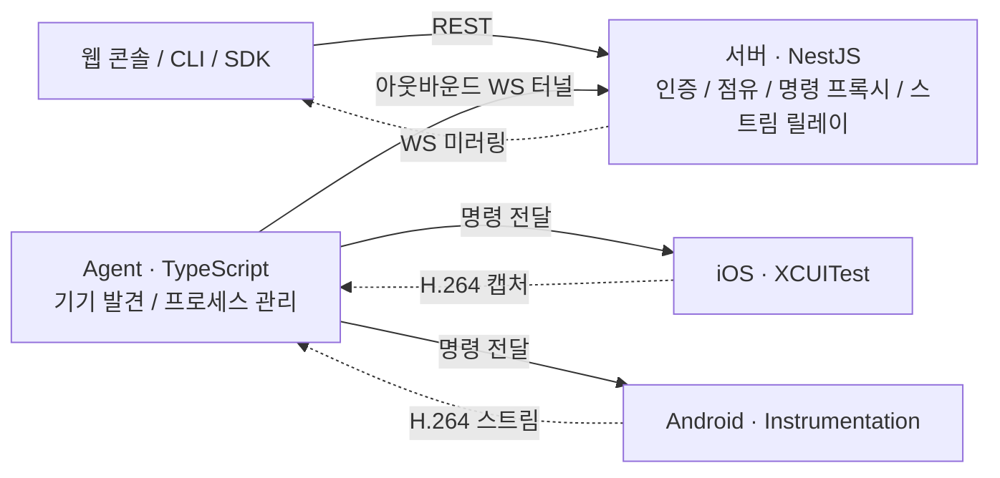

# nebula-clone

iOS·Android 실기기를 웹 브라우저와 CLI에서 원격으로 조작하는 디바이스 팜 학습 프로젝트.
토스의 [Nebula 소개 글](https://toss.tech/article/device-farm-nebula)에서 영감을 받은 독립 구현입니다.

## 주요 기능

- **웹 콘솔**: 기기 목록, 점유·해제, H.264 실시간 미러링과 클릭 조작
- **CLI·SDK**: 탭, 스와이프, 텍스트 입력, 홈 버튼, UI 덤프, 스크린샷
- **상시 구동 컨트롤러**: 기기마다 러너를 미리 실행하고 세션 생성 없이 명령 처리
- **Agent 자동화**: 기기 발견, 러너·미러링 프로세스 감시와 재기동
- **점유 관리**: 한 기기를 한 사용자가 점유하고, 유휴 점유는 기본 10분 후 회수

## 시작하기

명령은 별도 안내가 없으면 저장소 루트에서 실행합니다.

### 요구사항

- macOS, Node.js 24 이상, pnpm
- iOS: Xcode 전체 설치, XcodeGen, `iproxy`, 서명용 Apple ID
- iPhone: 개발자 모드 활성화, Mac 신뢰, 러너 설치 중 잠금 해제. 미러링은 USB 연결 필요
- Android(선택): JDK 17 이상, Android SDK, adb, USB 디버깅을 허용한 기기
- 웹 콘솔: WebCodecs의 H.264 디코딩을 지원하는 브라우저

### 환경 설정

저장소를 클론한 뒤 의존성과 설정 파일을 준비합니다.

```bash
pnpm install
cp packages/server/.env.example packages/server/.env
cp packages/agent/.env.example packages/agent/.env
```

`openssl rand -hex 32`를 두 번 실행해 서로 다른 토큰을 생성하고 다음 값을 설정합니다.

| 파일 | 설정 | 값 |
|---|---|---|
| `packages/server/.env` | `NEBULA_CLIENT_TOKEN` | 웹·CLI용 토큰 |
| `packages/server/.env` | `NEBULA_AGENT_TOKEN` | Agent용 토큰 |
| `packages/agent/.env` | `NEBULA_AGENT_TOKEN` | 서버의 Agent 토큰과 동일한 값 |
| `packages/agent/.env` | `NEBULA_SERVER_URL` | 기본 `ws://localhost:3000/agent` |

토큰은 각각 24자 이상이어야 합니다. 예제의 `change-me` 값은 기동 시 거부됩니다.
추가 설정은 [서버 환경 변수](./packages/server/.env.example)와
[Agent 환경 변수](./packages/agent/.env.example)를 참고하세요.

### 기기 없이 실행

```bash
pnpm dev --fake
```

정적 기기로 목록·점유·해제를 확인할 수 있습니다. 실제 기기 조작과 미러링은 제공하지 않습니다.

### iOS 연결

```bash
brew install xcodegen libimobiledevice
cp controller-ios/local.yml.example controller-ios/local.yml
```

`controller-ios/local.yml`에 본인의 Apple Team ID를 입력한 뒤 프로젝트를 생성합니다.

```bash
cd controller-ios
xcodegen generate
open NebulaController.xcodeproj
cd ..
```

Xcode의 Signing에서 팀을 확인합니다. 최초 서명 시 키체인 접근을 허용해야 비대화형 실행이
가능합니다. 자세한 수동 실행과 문제 해결은 [iOS Controller 안내](./controller-ios/README.md)를 참고하세요.

```bash
pnpm dev
```

### Android 연결

```bash
brew install --cask android-platform-tools android-commandlinetools
sdkmanager "platform-tools" "platforms;android-36" "build-tools;36.0.0"
cp android-controller/local.properties.example android-controller/local.properties
```

SDK 라이선스에 동의하고 `local.properties`의 `sdk.dir`를 설치 경로로 수정합니다.

```bash
bash scripts/build-android.sh
pnpm dev
```

adb가 있으면 Android 발견·제어·미러링이 자동 활성화됩니다. Android만 사용할 때는
`packages/agent/.env`에 `NEBULA_XCODEBUILD_ENABLED=false`를 설정해 iOS 도구 검사를 생략합니다.
지원 범위와 연결 진단은 [Android 안내](./android-controller/README.md)를 참고하세요.

### 웹 콘솔 접속

`http://localhost:5173`을 열고 설정 패널에 서버 주소(기본 `http://localhost:3000`)와
`NEBULA_CLIENT_TOKEN`을 입력한 뒤 **연결**을 누릅니다. 기기를 점유하면 조작할 수 있습니다.

`Ctrl-C`로 개발 스택을 종료합니다. 로그는 `.dev-logs/`에 저장되며,
`pnpm dev`를 다시 실행하면 기존 개발 스택을 종료하고 시작합니다.

## CLI

```bash
export NEBULA_SERVER_URL=http://localhost:3000
export NEBULA_CLIENT_TOKEN='발급한 클라이언트 토큰'

pnpm cli devices list
pnpm cli devices occupy --platform ios
pnpm cli tap --x 200 --y 400
pnpm cli screenshot --out shot.jpg
pnpm cli devices release
```

점유 정보는 로컬 `~/.nebula/session.json`에 저장되어 다음 명령에서 재사용됩니다.
전체 명령과 종료 코드는 [CLI 안내](./packages/cli/README.md)를 참고하세요.

## 구조



Agent가 서버로 연결한 WebSocket 터널을 통해 명령과 미러링 데이터를 전달합니다.
서버가 NAT 뒤의 Agent로 직접 접속할 필요가 없습니다. iOS와 Android 컨트롤러는
동일한 HTTP 계약을 사용하며, 클라이언트 요청의 결과는 Agent와 서버를 거쳐 반환됩니다.

| 경로 | 역할 |
|---|---|
| `packages/server` | NestJS API, SQLite 기기·점유 저장소, WS 터널·릴레이 |
| `packages/agent` | Mac에서 기기 발견, 컨트롤러와 미러링 프로세스 관리 |
| `packages/web` | React 웹 콘솔, WebCodecs H.264 디코딩 |
| `packages/client` | OpenAPI 생성 타입과 fetch 기반 SDK |
| `packages/cli` | SDK를 사용하는 CLI |
| `packages/shared` | 공용 프로토콜·타입·프레임 코덱 |
| `controller-ios` | Swift/XCUITest 기기 제어 러너 |
| `mirror-helper` | macOS 캡처 장치와 VideoToolbox를 이용한 iOS 미러링 |
| `android-controller` | Kotlin 제어 러너와 MediaCodec 미러링 데몬 |

점유 TTL은 점유·명령·keepalive 요청으로 갱신됩니다. Agent 하트비트와 미러링 시청은
갱신하지 않습니다. 웹 keepalive도 사용자 입력이 30분 동안 없으면 중단됩니다.
미러링은 현재 점유자만 시청할 수 있습니다.

## 개발 명령

| 명령 | 설명 |
|---|---|
| `pnpm build` | 워크스페이스 패키지 빌드 |
| `pnpm test` | 워크스페이스 테스트 |
| `pnpm affected` | 변경 영향이 있는 패키지 빌드·테스트 |
| `pnpm graph` | 패키지 의존성 그래프 |
| `pnpm openapi` | 서버 OpenAPI와 클라이언트 타입 재생성 |

서버 API 변경 후에는 `pnpm openapi`로 생성물을 갱신합니다.
[OpenAPI 스펙](./packages/server/openapi.json)은 저장소에 포함됩니다.
서버의 `ENABLE_DOCS=true` 설정으로 `/docs`의 Swagger UI를 열 수 있습니다.
Swagger는 인증 없이 공개되므로 기본값은 `false`입니다. `/health`는 공개 상태 확인 경로이며,
기기 API에는 클라이언트 토큰이 필요합니다.

## 상시 실행

macOS LaunchAgent로 서버와 Agent를 로그인 시 자동 실행할 수 있습니다.
웹 개발 서버는 포함되지 않으며, `pnpm dev`와 동시에 사용할 수 없습니다.

```bash
scripts/daemon.sh install
scripts/daemon.sh status
scripts/daemon.sh restart
scripts/daemon.sh uninstall
```

설치 전 환경 설정과 네이티브 빌드를 완료해야 합니다. launchd 설치 환경의 장기 구동은 미검증입니다.

## 지원 범위와 제약

- 실기기 확인 범위는 iPhone 14 Pro Max(iOS 26.6.1), ZFold8(Android 17)입니다.
  다른 기기·OS 조합은 미검증입니다.
- iOS 이벤트 합성과 Android 미러링은 비공개 API를 사용해 OS 업데이트에 영향을 받을 수 있습니다.
- 무료 Apple ID의 iOS 프로비저닝은 7일 후 만료됩니다. 무인 자동 갱신은 미검증입니다.
- macOS 26에서 iOS 캡처 장치가 보이지 않으면 QuickTime의 동영상 녹화 소스 목록을 열어야 할 수 있습니다.
  재연결·재부팅 후 자동 인식은 미검증입니다. [미러링 안내](./mirror-helper/README.md)를 참고하세요.
- Android의 `FLAG_SECURE` 화면은 미러링할 수 없습니다.
- Android에서 다른 UiAutomation 기반 도구와 동시에 제어할 수 없습니다.
- 단일 서버·소규모 기기 운영을 위한 학습 구현입니다. 분산 테스트 큐와 다중 서버 운영은 포함하지 않습니다.
